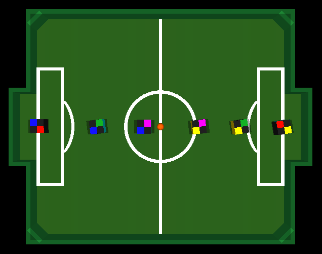
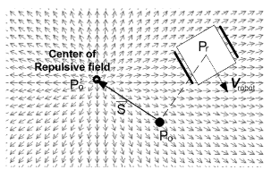

# ITAndroids Univector Control Optimization

This project consists of the changes made to the files in the ITAndroids VSS Repository, the robotics team of ITA, to optimize the Univector Control of the attackers using the AI technique of CMA-ES (Covariance Matrix Adaptation Evolution Strategy) and a reward engineering process.

## Project Overview

The optimization process focuses on enhancing the performance of the Univector Control mechanism used by the attackers in the VSS (Very Small Size) robotics competition. By leveraging the AI technique of CMA-ES and a carefully designed reward engineering process, the attackers' decision-making capabilities and overall efficiency are significantly improved.

## Project Photo

Images of the simulator where the optimization ran.

## Univector Field 

## Included Files

- **Source Code Changes:** The repository contains modifications to the existing control algorithms, integrating the CMA-ES technique and reward engineering.
- **Paper:** A detailed paper is included, describing the methods and results of the optimization process.

## Confidentiality

Please note that the entire project is not public. The methods, results, and the paper describing the process are intended for internal use within the ITAndroids team.

## Contact

For more information or access requests, please contact the ITAndroids team.
